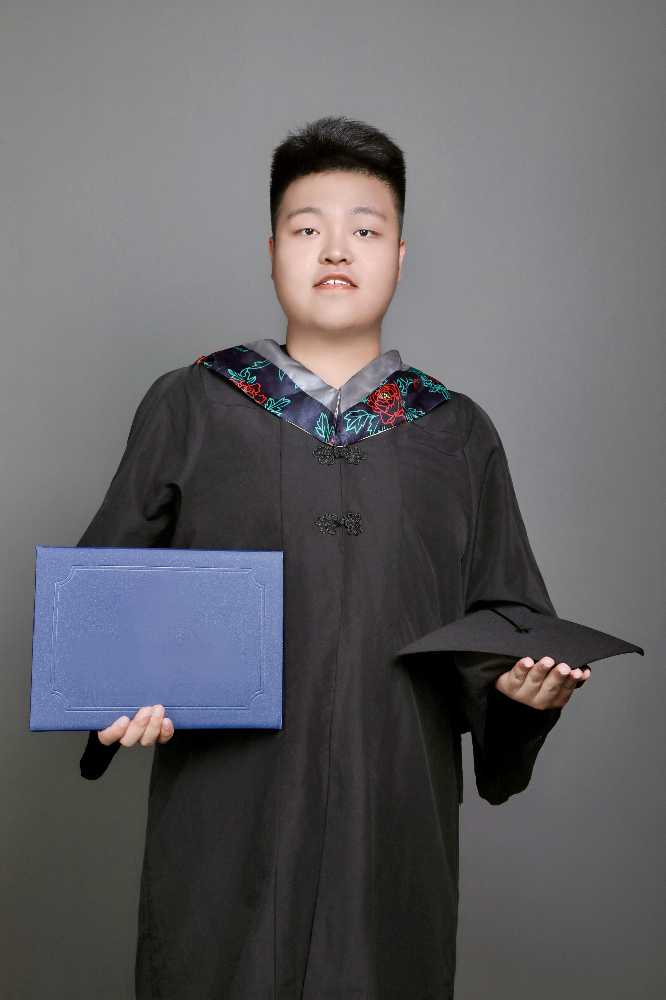



<a href="../files/Haonan Wang_cv.pdf" class="uline">Click here for a full pdf copy of my CV</a>

Education
======
**In Progress** 
Master in Computer Science 
[Johns Hopkins University](https://www.jhu.edu), Baltimore, MD,USA 
*Advisor: [Prof. Jason Esiner](https://www.cs.jhu.edu/~jason/)*

**2019-2023** 
B.S. in Information and Computing Science 
[Liaoning Technology University](https://www.lntu.edu.cn),FuXin,Liaoning,China 
*Advisor1: [Prof. Wei liu](http://lxy.lntu.edu.cn/info/1068/2235.htm)*
*Advisor2: [Prof. Fanhui Zeng](http://lxy.lntu.edu.cn/info/1068/2232.htm)*
*Advisor3: [Prof. Yu Zhang](http://lxy.lntu.edu.cn/info/1068/2242.htm)*

Awards
======
## Outstanding award
**National Scholarship, China Ministry of Education, 2022 (top 1%)**\
 

**National Scholarship, China Ministry of Education, 2022 (top 1%)**

  

<table>
<tr>
<td>

**National Scholarship, China Ministry of Education, 2022 (top 1%)**

</td>
<td>

</td>
</tr>
</table>

**Outstanding Student Scholarship, Special Prize,LNTU,2023(0.001%)**\
## Other award
Outstanding Special Student Scholarship,First Prize,LNTU,2021\
Outstanding Special Student Scholarship,First Prize,LNTU,2021\
Outstanding Special Student Scholarship,First Prize,LNTU,2020\
Outstanding Special Student Scholarship,Second Prize,LNTU,2019\
14th National Undergraduate Computer Design Competition,Third Prize,Hangzhou,China,2021\
12th MathorCup College Mathematical Modeling Challenge,First Prize,Beijing,China,2022\
Liaoning Mathematical Modeling Contest,First Prize, Shenyang,China,2022\
7th Shuwei Mathematical Modeling Challenge for College Students,First Prize,Beijing,China,2022\
Liaoning Province "Shuo Ri Cup" College Student Computer Design,Third Prize,Shenyang,China,2022\
LNTU Computer Design Competition,First Prize,Fuxin,China,2022\
Northeast Three Provinces Mathematical Modeling Competition,Third Prize,Dalian,China,2022\
American Mathematical Contest in Modeling,Second Prize,USA,2021\
11th Mathor Cup University Mathematical Modeling Challenge,Third Prize,Beijing,China,2021\
National College Students "Hua Shu Cup" Mathematical Modeling,Second Prize,Beijing,China,2021

